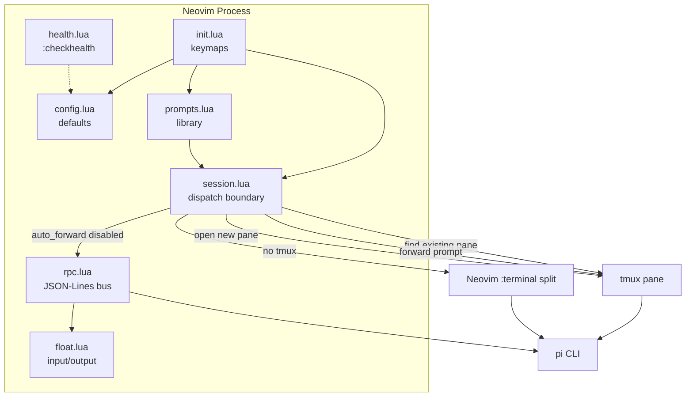

# pi.nvim

Neovim plugin for the [Pi coding agent](https://github.com/earendil-works/pi-coding-agent). Ask questions about your code from inside Neovim. Pi can run in a tmux pane, a Neovim terminal split, or a floating output window.

## Features

- **Ask from anywhere** — press `<leader>pa`, type a question, Pi gets the current file or visual selection as context
- **Tmux forwarding** — when a Pi session is already running in a tmux pane, prompts are sent there instead of starting a new one
- **Terminal fallback** — without tmux, Pi opens in a vertical Neovim terminal split
- **Floating output** — when forwarding is disabled, responses stream into a floating window
- **Prompt library** — pick from explain/fix/test prompts with `<leader>pp`
- **Send file or selection** — one-key shortcuts for common actions (`<leader>pf`, `<leader>ps`)
- **Health check** — `:checkhealth pi-nvim` verifies Pi installation and config
- **Optional snacks.nvim integration** — enhanced input UI when snacks is available

## Requirements

- Neovim 0.7+
- Node.js >= 22.19.0 (required by pi-coding-agent)
- [Pi](https://github.com/earendil-works/pi-coding-agent) installed and configured with at least one model
  ```bash
  npm i -g @earendil-works/pi-coding-agent
  ```
- (Optional) tmux — enables session forwarding to existing Pi panes
- (Optional) [snacks.nvim](https://github.com/folke/snacks.nvim) for the enhanced input window

## Installation

### lazy.nvim

```lua
{
  "yanralapdy/pi.nvim",
  opts = {},
  dependencies = { "folke/snacks.nvim" }, -- optional
}
```

### packer.nvim

```lua
use {
  "yanralapdy/pi.nvim",
  config = function()
    require("pi-nvim").setup({})
  end,
}
```

### Manual

```bash
git clone https://github.com/yanralapdy/pi.nvim \
  ~/.local/share/nvim/site/pack/plugins/start/pi.nvim
```

## Configuration

Default options:

```lua
require("pi-nvim").setup({
  pi_cmd = "pi",
  pi_args = { "--mode", "rpc", "--no-session" },
  snacks = true,
  float_input = {
    width = 80,
    height = 20,
    border = "rounded",
  },
  float_output = {
    width = 80,
    height = 30,
    border = "rounded",
  },
  keymaps = {
    ask = "<leader>pa",
    select = "<leader>ps",
    file = "<leader>pf",
    prompt = "<leader>pp",
  },
})
```

| Option | Default | Description |
|--------|---------|-------------|
| `pi_cmd` | `"pi"` | Path to the Pi CLI binary |
| `pi_args` | `{ "--mode", "rpc", "--no-session" }` | Arguments passed to Pi |
| `snacks` | `true` | Use snacks.nvim for input if available |
| `float_input` | see above | Input window dimensions and border style |
| `float_output` | see above | Output window dimensions and border style |
| `session.auto_forward` | `true` | Forward prompts to existing pi tmux session when available |
| `keymaps.ask` | `"<leader>pa"` | Keybinding to trigger the ask flow (visual mode) |
| `keymaps.select` | `"<leader>ps"` | Keybinding for the action menu (visual mode) |
| `keymaps.file` | `"<leader>pf"` | Keybinding to send file path to Pi (normal + visual mode) |
| `keymaps.prompt` | `"<leader>pp"` | Keybinding to pick a prompt (visual mode) |

## Usage

### Visual mode

1. Select code with `V` or `v`
2. Press `<leader>pa`
3. The floating input window opens — type your question and press `Enter` to submit
4. The selected code (file path, line range, content) is automatically included in the prompt sent to Pi
5. Pi receives the prompt in a tmux pane, terminal split, or floating output window — whichever is available
6. When using the floating output window, press `q` or `<Esc>` to close it

### Tmux integration (optional)

If tmux is installed and a Pi session is running in a tmux pane, `<leader>pa` forwards your prompt directly to that session instead of opening a new terminal. Without tmux, Pi opens in a Neovim terminal split automatically.

### Keybindings

| Key | Mode | Action |
|-----|------|--------|
| `<leader>pa` | v | Ask Pi — opens input, sends prompt with context |
| `<leader>ps` | v | Action menu — send file, ask selection, or pick a prompt |
| `<leader>pf` | n, v | Send current file path to existing Pi session |
| `<leader>pp` | v | Pick a prompt (explain, fix, test, etc.) and send with context |

### Commands

| Command | Action |
|---------|--------|
| `:PiAsk` | Trigger the ask flow from normal mode (asks about current buffer or no selection) |
| `:checkhealth pi-nvim` | Verify installation and configuration |

## Architecture



## How it works

1. You press `<leader>pa` in visual mode
2. The plugin captures the visual selection
3. You type your question in the input window
4. The plugin builds the final prompt with your question + file/selection context
5. `session.lua` decides where to send it:
   - If a Pi session is running in a tmux pane → forward there
   - Else if tmux is available → open a new tmux pane with Pi and send the prompt
   - Else → open Pi in a Neovim terminal split and send the prompt
6. When forwarding is disabled (`session.auto_forward = false`), Pi runs over RPC and streams the response into a floating output window

## License

MIT
